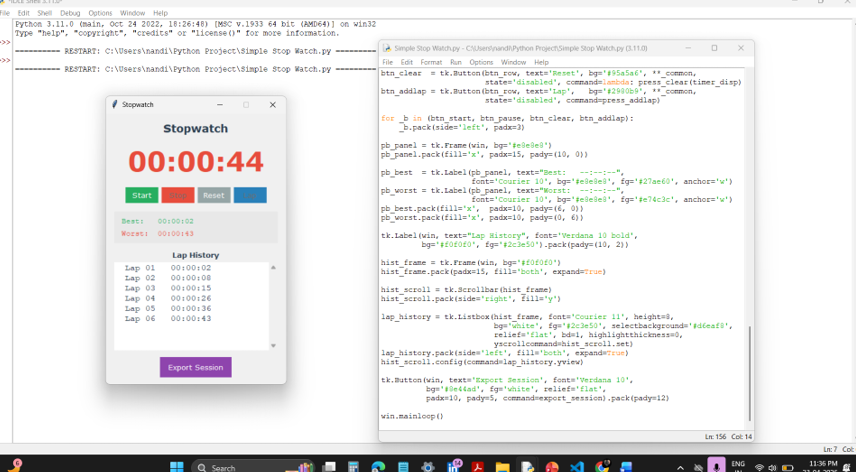

# ⏱️ Simple Stopwatch (Python GUI Project)

A simple yet powerful stopwatch application built using Python and Tkinter.  
Developed as a **Semester 2 Project** at UPES (University of Petroleum and Energy Studies).

---

## 🚀 Features

- ▶️ Start, Stop, Reset functionality  
- ⏱️ Real-time time tracking  
- 🏁 Lap recording system  
- 📊 Best & Worst lap calculation  
- 💾 Export session data to file  
- 🎨 Clean and user-friendly GUI  

---

## 🖥️ Tech Stack

- Python 3  
- Tkinter (GUI Library)  
- datetime module  

---

## 📸 Screenshots

### 🟢 Main Screen


### 🔵 Running Stopwatch


### 🟣 Lap Records


---

## ⚙️ Installation & Setup

### Step 1: Clone the repository
```bash
git clone https://github.com/your-username/simple-stopwatch.git
